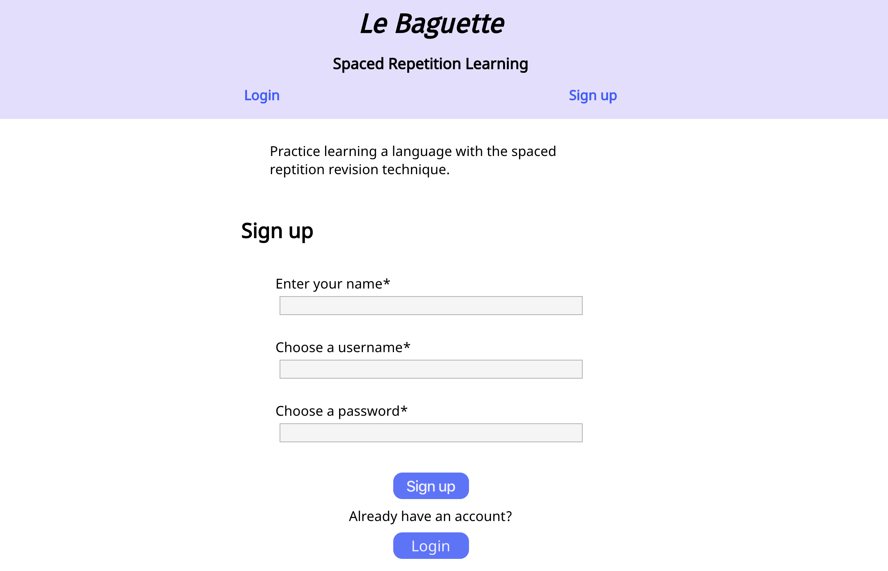
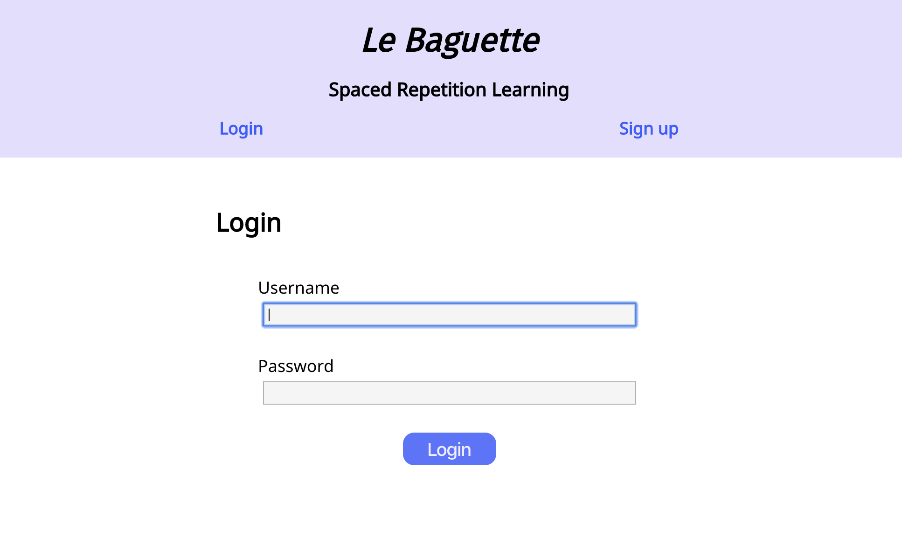
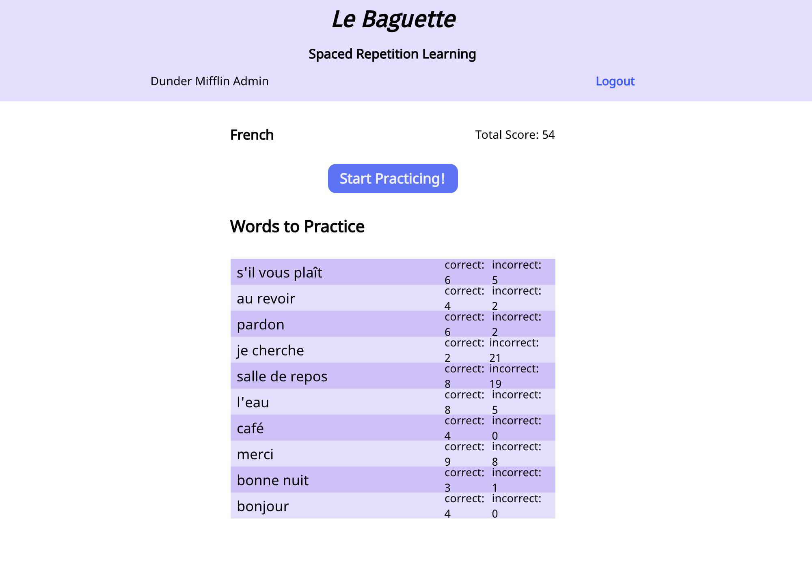
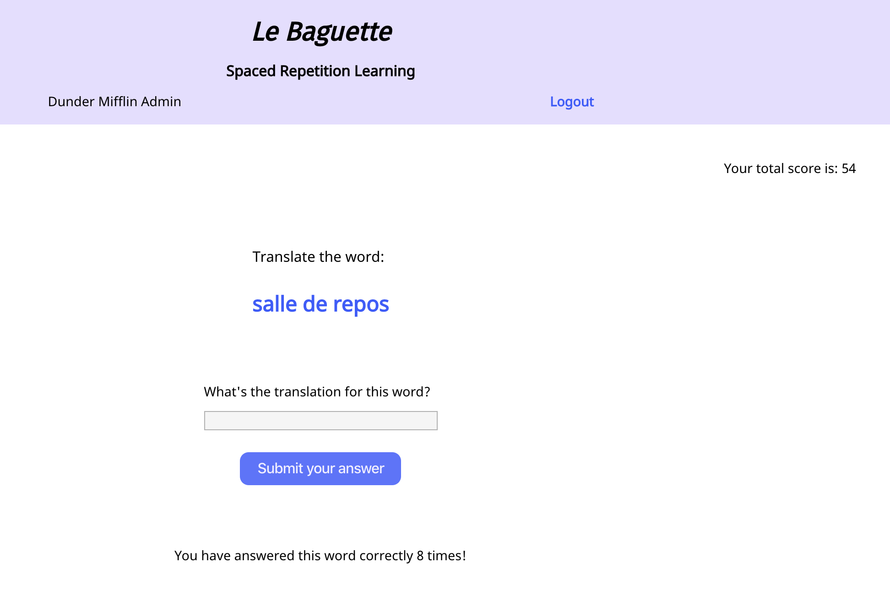
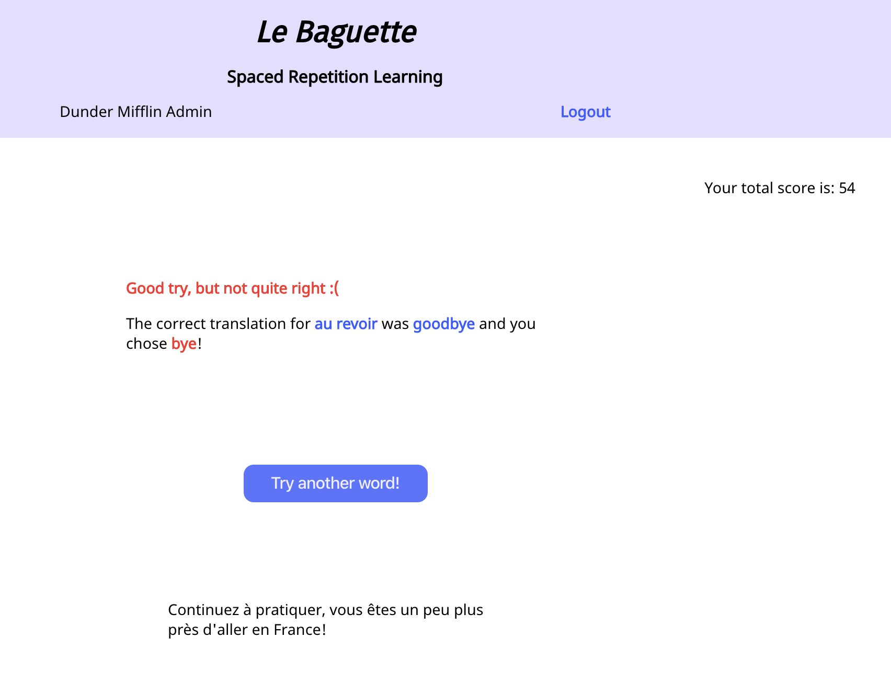

 # Le Baguette : Learn French with Space Repetition.

 # About
 Before taking a trip to France, learn essential words quickly and effectivley! This application uses space repetition flashcards that keep track of user scores. It also displays the user scores for every word they are learning, letting them know how many times they got it right and how many times they got it wrong. It allows users to create personailzed accounts that diplay their name on the top of the dashboard and lets them keep track of their progress by logging into their personal accounts.

## Account login for demo: 
### username : admin
### password: pass

## Live page can be found here !
### ZEIT:
[click here for live page](https://spaced-repetition-app.mal3905.now.sh/learn)


## Technoligies Used
Client side: React, Javascript, HTML and CSS
Server side: Express.js, Node.js, PostgreSQL

## Links to code 
Client : [Client](https://github.com/thinkful-ei-heron/Dan_Maria_Spaced-Repetition.git)
Server: [Server](https://github.com/thinkful-ei-heron/Dan_Maria_Spaced-Repitition-API.git)

## Screen Shots
### Registration page 

### Login Page

### Dashboard

### Learning Page

### Learning Feedback Page



created by : Daniel Wagner and Maria Danielson 2019


# Spaced Repetition Capstone Setup

## Setup

To setup the application

1. Fork and clone the project to your machine
2. `npm install`. This will also install the application *Cypress.io* for running browser integration tests

The project expects you have the Spaced repetition API project setup and running on http://localhost:8000.

Find instructions to setup the API here https://github.com/Thinkful-Ed/spaced-repetition-api.

## Running project

This is a `create-react-app` project so `npm start` will start the project in development mode with hot reloading by default.

## Running the tests

This project uses [Cypress IO](https://docs.cypress.io) for integration testing using the Chrome browser.

Cypress has the following expectations:

- You have cypress installed (this is a devDependency of the project)
- You have your application running at http://localhost:3000.
  - You can change the address of this expectation in the `./cypress.json` file.
- Your `./src/config.js` is using http://localhost:8000/api as the `API_ENDPOINT`

To start the tests run the command:

```bash
npm run cypress:open
```

On the first run of this command, the cypress application will verify its install. Any other runs after this, the verification will be skipped.

The command will open up the Cypress application which reads tests from the `./cypress/integration/` directory. You can then run individual tests by clicking on the file names or run all tests by clicking the "run all tests" button in the cypress GUI.

Tests will assert against your running localhost client application.

You can also start all of the tests in the command line only (not using the GUI) by running the command:

```bash
npm run cypress:run
```

This will save video recordings of the test runs in the directory `./cypress/videos/`.
